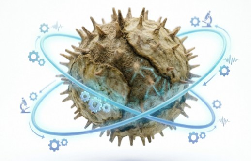
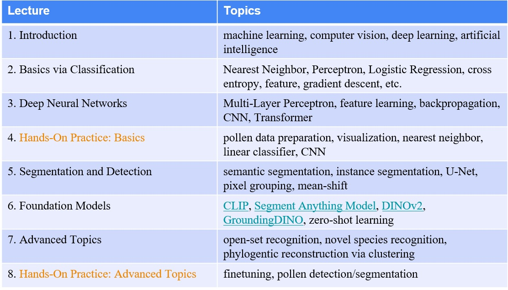

<h1>Short Course: Deep Learning and its Applications to Pollen Analysis</h1>

<h3>by <a href="https://aimerykong.github.io/" target="_blank" rel="noopener noreferrer">Shu Kong</a></h3>

This repository hosts teaching materials for the short course at the [43rd Mid-Continent Paleobotanical Colloquium](https://striresearch.si.edu/mpc2026/).
Focusing on the theme of applying deep learning to automate pollen analysis, this course covers relevant techniques in computer vision, machine learning, and deep learning.
It will provide hands-on coding experience to demonstrate how to apply these techniques to pollen image processing, recognition, segmentation/detection, novel species recognition, and so on.
It will also teach how to exploit foundation models or AI agents for more precise pollen recognition and detection.
Slides will be uploaded after this short course. Refer to the following for the syllabus and important dates.

## Syllabus
The syllabus of this course is as follows.

## Time and Venue
- The full-day course will take place from 9:00 a.m. – 5:00 p.m. at the Center for Tropical Paleoecology and Archaeology (CTPA), March 26, 2026.
- The MPC will take place on March 23-26, 2026, at the Smithsonian Tropical Research Institute (STRI) in Panama, one of the most biodiverse and ecologically rich regions in the world.

## Materials

- Jupyter Notebook files are for hands-on coding. They can be imported to Google Colab, which will be used in this short course.
- Each Jupyter Notebook file contains implementation details and comments. Refer to them when running the notebooks.
- Datasets used in this short course are included in the **datasets** folder.
- Finalized slides in pdf will be uploaded to the **slides** folder after this course (by April, 2026). 

## Contact
 - Regarding MPC2026, contact the organizers listed in the [website](https://striresearch.si.edu/mpc2026/)
 - Regarding the short course, contact the instructor [Shu Kong](https://aimerykong.github.io/) via aimerykong@gmail.com with a subject line "*short course at MPC2026*"

## References
1. Kong, et al., ["Spatially Aware Dictionary Learning and Coding for Fossil Pollen Identification"](https://arxiv.org/abs/1605.00775), CVPRW, 2016
2. Punyasena, et al., ["Automated identification of diverse Neotropical pollen samples using convolutional neural networks"](https://besjournals.onlinelibrary.wiley.com/doi/full/10.1111/2041-210X.13917), Methods in Ecology and Evolution, 2021
3. Romero, et al., ["Improving the taxonomy of fossil pollen using convolutional neural networks and superresolution microscopy"](https://www.pnas.org/doi/10.1073/pnas.2007324117), PNAS, 2020
4. Adaïmé, et al., ["Deep learning approaches to the phylogenetic placement of extinct pollen morphotypes"](https://academic.oup.com/pnasnexus/article/3/1/pgad419/7471798), PNAS Nexus, 2024
5. Feng, et al., ["Addressing the “open world” - detecting and segmenting pollen on palynological slides with deep learning"](https://www.cambridge.org/core/journals/paleobiology/article/addressing-the-open-world-detecting-and-segmenting-pollen-on-palynological-slides-with-deep-learning/7F12E2B1F72DC18ABA73D460A90BCDD4), Paleobiology, 2025
6. Adaïmé, et al., ["Deep learning of fossil pollen morphology reveals 25,000 years of ecological change in East African grasslands"](https://www.biorxiv.org/content/10.1101/2024.09.23.612957v3), 2026
7. Kong & Ramanan, ["OpenGAN: Open-Set Recognition via Open Data Generation"](https://openaccess.thecvf.com/content/ICCV2021/html/Kong_OpenGAN_Open-Set_Recognition_via_Open_Data_Generation_ICCV_2021_paper.html), ICCV, 2021
8. Kong & Fowlkes, ["Recurrent Pixel Embedding for Instance Grouping"](https://openaccess.thecvf.com/content_cvpr_2018/papers/Kong_Recurrent_Pixel_Embedding_CVPR_2018_paper.pdf), CVPR, 2018
